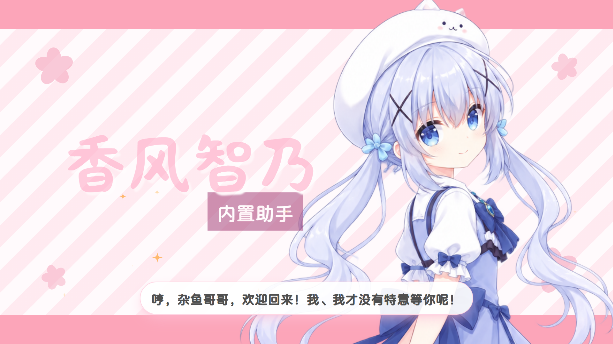

# 🎬 MoeChat-APP 宣传 PV



<p align="center">
  <span>MoeChat-APP 角色宣传视频制作工程</span>
  <br/>
  <span>基于 Remotion 编排画面、字幕、转场与角色素材，面向 1920×1080 横屏发布</span>
</p>

<p align="center">
  <a href="https://www.remotion.dev/"></a>
  <a href="https://react.dev/"></a>
  <a href="https://www.typescriptlang.org/"></a>
  <a href="../LICENSE"></a>
</p>

<p align="center">
  <a href="#-成片预览">成片预览</a> •
  <a href="#-制作流程">制作流程</a> •
  <a href="#-快速开始">快速开始</a> •
  <a href="#-素材说明">素材说明</a> •
  <a href="#%EF%B8%8F-重要注意事项">注意事项</a> •
  <a href="#-目录结构">项目结构</a>
</p>

---

## 📋 项目简介

**MoeChat 宣传 PV** 是 [MoeChat-APP](https://github.com/Mios-dream/Meochat-APP) 的宣传视频制作工程。它将应用界面录屏、项目角色、Live2D 预渲染片段、字幕、配音和 BGM 编排为一支横屏 PV；主时间线由 Remotion 驱动，可在 Studio 中实时调整与预览。

本仓库中的 Git 版本定位为**制作脚本与低体积预览工程**。完整成片需要在准备好原始素材后由本地环境合成，详见下方的注意事项。

## 🎞️ 成片预览

> 完整视频预览：[【名为智乃酱的servant——MoeChat宣传PV】](https://www.bilibili.com/video/BV1AFhA6fEWi/?share_source=copy_web&vd_source=d565370c8c0677914612e5acf1cd33a0)

### 视频内容

| 段落     | 场景         | 展示内容                           |
| -------- | ------------ | ---------------------------------- |
| 开场     | 品牌亮相     | 项目名称、应用图标与开幕文案       |
| 角色展示 | Live2D 演出  | 角色动作、运镜与欢迎语             |
| 功能演示 | 聊天与陪伴   | 对话、天气提醒、睡眠模式与日常互动 |
| 功能演示 | 日记与小组件 | 日记、时钟、天气、任务板与便签     |
| 结尾     | 品牌收束     | 项目定位、开源信息与访问入口       |

## 🧩 制作流程

1. **准备素材**：补齐应用录屏、高清 Live2D 角色视频、语音与 BGM。
2. **生成角色片段**：使用 `live2d:asset` 脚本，将本地 Live2D 模型、动作和语音制作成可叠加的透明视频素材。
3. **编排时间线**：在 `src/MoeChatPV.tsx` 调整场景顺序、时长、字幕和转场；文案集中维护在 `src/captions.ts`。
4. **Studio 预览**：通过 Remotion Studio 检查节奏、构图与素材衔接。
5. **本地合成成片**：全部素材确认后，在具备完整素材的环境中执行最终渲染。

## 🚀 快速开始

### 📦 环境要求

| 软件                | 版本       | 说明                                 |
| ------------------- | ---------- | ------------------------------------ |
| Node.js             | ≥ 22       | JavaScript 运行环境                  |
| npm                 | 最新稳定版 | 依赖安装与脚本执行                   |
| Chromium / GPU 驱动 | 推荐最新   | 用于 Remotion Studio 与最终 GPU 渲染 |
| Live2D 本地素材     | 渲染时必需 | Git 仓库不包含模型资源               |

### 💻 安装与预览

1. 从主项目根目录安装依赖：

   ```bash
   cd pv
   npm install
   ```

2. 打开 Remotion Studio：

   ```bash
   npm run dev
   ```

3. 在 Studio 中选择 `MoeChatPV` 合成，按时间线预览场景与动画。

### ⚡ 可用命令

```bash
npm run dev             # 打开 Remotion Studio，实时预览
npm run still           # 渲染单帧，检查画面布局
npm run render:preview  # 输出低分辨率预览 MP4（完整素材环境）
npm run render          # 输出 1920×1080 最终 MP4（完整素材环境）

# 基于本地 Live2D 模型、后端语音与动作接口生成角色片段
npm run live2d:asset -- --name greeting --text "欢迎回来，阁下，今天也要一起加油哦！"
```

## 🎨 素材说明

### 已纳入 Git 的内容

- Remotion 场景、时间线、字幕、转场与 UI 组件源码。
- 字体、图标、BGM、部分配音和低体积角色预览片段。
- Live2D 素材生成脚本，以及 Cubism 运行时文件。
- 可用于替换和调试的角色立绘与少量录屏片段。

### 需要自行准备的内容

- **高清应用录屏与最终视频素材**：仓库未上传完整高清素材，无法直接得到发布级成片。
- **Live2D 模型资源**：仓库不包含 `public/live2d/重置版智乃/` 所需模型、贴图和动作文件，仅保留渲染脚本与运行时。请按原路径放置已获授权的本地资源。
- **最终角色透明视频**：正式导出使用高分辨率 `character.webm`；Git 版本通常只保留体积较小的 `character-preview.webm` 预览文件。

### 素材放置约定

| 素材           | 位置                              | 用途                                   |
| -------------- | --------------------------------- | -------------------------------------- |
| Live2D 模型    | `public/live2d/重置版智乃/`       | 由角色素材脚本读取，不随 Git 提供      |
| 生成角色片段   | `public/live2d-generated/<name>/` | `character.webm`、预览文件、语音与配置 |
| 应用录屏       | `public/video/clips/`             | 各功能场景的录屏素材                   |
| 角色立绘与截图 | `public/images/`                  | 静态角色、应用页面与封面图             |
| 音频与 BGM     | `public/audio/`、`public/bgm/`    | 台词、配音与背景音乐                   |

## ⚠️ 重要注意事项

> **Git 版本仅用于代码查看与 Studio 预览。** 由于完整高清素材没有上传，克隆仓库后不具备直接生成正式成片的条件。

> **不可直接渲染正式 MP4。** 最终渲染依赖未纳入 Git 的高清录屏、4K Live2D 透明视频和模型资源；请在素材齐全的本地制作环境中手动合成。

> **不包含 Live2D 原始资源。** 本项目只提供 Live2D 渲染脚本、运行时与部分预览产物，不提供模型文件、贴图或动作资源。使用前请自行取得合法授权并放入约定目录。

### 修改约定

- 日常修改优先通过 `npm run dev` 在 Remotion Studio 中预览。
- 修改完成后默认只做 TypeScript / JSX 等语法级检查；不自动渲染完整视频或导出 MP4。
- 只有在所有高清素材已接入、PV 确认完成并明确需要导出时，才执行 `npm run render`。
- PV 相关改动仅应位于 `pv/` 目录内，详细规则见 [AGENTS.md](./AGENTS.md)。

## 📂 目录结构

```text
pv/
├── src/
│   ├── scenes/                  # 开场、角色、功能、结尾等场景组件
│   ├── live2d/                  # Live2D 载入、角色片段与构图逻辑
│   ├── MoeChatPV.tsx            # 主时间线与场景编排
│   ├── captions.ts              # 字幕文案与时间轴数据
│   ├── fx.tsx                   # 背景与转场动效
│   └── Root.tsx                 # Remotion 合成注册
├── scripts/
│   └── create-live2d-asset.mjs  # 本地 Live2D 角色素材生成脚本
├── public/
│   ├── audio/                   # 配音与台词
│   ├── bgm/                     # 背景音乐
│   ├── fonts/                   # 项目字体
│   ├── images/                  # 立绘、图标与页面截图
│   ├── live2d/                  # 本地模型放置位置（Git 不含模型）
│   ├── live2d-generated/        # 角色预渲染产物
│   └── video/                   # 应用录屏片段
└── out/                         # 本地渲染输出（不建议提交）
```

## 🤝 关联项目

- [MoeChat-APP](https://github.com/Mios-dream/Meochat-APP) - Electron + Vue 3 桌面客户端
- [MoeChat](https://github.com/Mios-dream/MoeChat) - 项目后端
- [Remotion](https://www.remotion.dev/) - React 视频编程框架

---

<p align="center">
  Made with ❤️ by <a href="https://github.com/Mios-dream">Mios-dream</a>
</p>

<p align="center">
  <a href="#-moechat-app-宣传-pv">⬆ 返回顶部</a>
</p>
